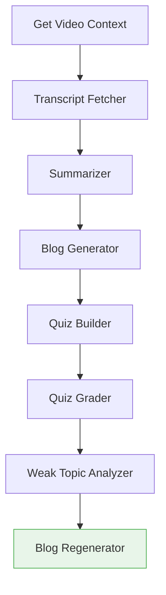

# YouTube Focus **AI Agent** — Chrome Extension

> Remove distractions on YouTube and generate AI-powered summaries, blogs, and quizzes. Analyze quiz results to find weak topics and regenerate a personalized blog at your chosen readability level.

---

## Table of Contents

* [Overview](#overview)
* [Key Features](#key-features)
* [How It Works (LangGraph)](#how-it-works-langgraph)
* [Configuration](#configuration)
* [Usage](#usage)

---

## Overview

**YouTube Focus AI Agent** is a Manifest V3 Chrome extension built with **React** and orchestrated with **LangGraph**. It removes common distractions on YouTube—ads, recommendations, Shorts, and comments—so you can focus on content. The built‑in **AI agent** digests the current video to:

* Create **summaries** for quick review
* Draft **blogs/articles** you can tune by **readability level** and **regenerate** on demand
* Produce **quizzes** from the video, grade your answers, and **diagnose weak topics**
* Update the generated blog to emphasize your **weak areas**

All this happens from a clean, distraction‑free player.

---

## Key Features

* 🧽 **Distraction remover**: Hides homepage recommendations, sidebar suggestions, end‑cards, comments, Shorts, and most ad UI elements.
* 🧠 **AI Agent content suite**:

  * **Summary** of the current video
  * **Blog/article generator** with adjustable **readability level** (Beginner → Advanced)
  * **Quiz builder** (MCQ / short answer) + **grading**
  * **Weak topic analysis** that feeds back into the blog (auto‑regenerate with targeted sections)
* ♻️ **Regenerate** content with new constraints (tone, length, outline, keywords).
* ⚙️ **Customizable**: per‑site toggles, hotkeys, and persistent settings via `chrome.storage`.
* 🧩 **LangGraph**: deterministic graph orchestration of LLM tools and functions.
* 🧭 **Non‑intrusive UI**: popup + in‑page panel; one click to switch modes (Focus / Learn).

---

## How It Works (LangGraph)

The extension’s **LangGraph** defines a tool‑calling pipeline that responds to user intents:

* **Transcript Fetcher**: uses YouTube timed text (or a fallback extractor) to obtain transcript + timestamps.
* **Summarizer**: builds a dense summary with key points & timestamps.
* **Blog Generator**: creates a structured article; accepts **readability** and **tone**.
* **Quiz Builder**: generates questions aligned to the video outline.
* **Quiz Grader**: evaluates answers and collects per‑topic scores.
* **Weak Topic Analyzer**: pinpoints low‑score areas.
* **Blog Regenerator**: rewrites/augments sections with focus on weak topics.

> Powered by your configured LLM provider. The **AI Agent** uses function/tool calls inside LangGraph nodes to keep steps deterministic and auditable.

## Configuration

* **Focus toggles** (popup → Settings):

  * Hide homepage recommendations
  * Hide video sidebar suggestions
  * Hide end screen cards
  * Hide Shorts
  * Hide comments
  * Hide ad containers (UI only)
* **AI Agent**:

  * Readability: *Beginner*, *Intermediate*, *Advanced*
  * Quiz mode: *MCQ*, *Short Answer*, *Mixed*

Settings persist via `chrome.storage.sync`.

---

---

## Usage

1. Open any YouTube video
2. Click the extension icon → **Focus Mode** toggles to instantly remove distractions
3. In the **AI** panel, choose a tab:

   * **Summary** → generate/update summary
   * **Blog** → pick readability, tone, length → **Generate** or **Regenerate**
   * **Quiz** → build a quiz, submit answers, view grading & weak topics
   * **Improve Blog** → one‑click regeneration that emphasizes your weak topics
4. Export blog/quiz to Markdown or copy to clipboard (buttons in the panel)

---

## Readability Levels

* **Beginner**: short sentences, common words, clear definitions
